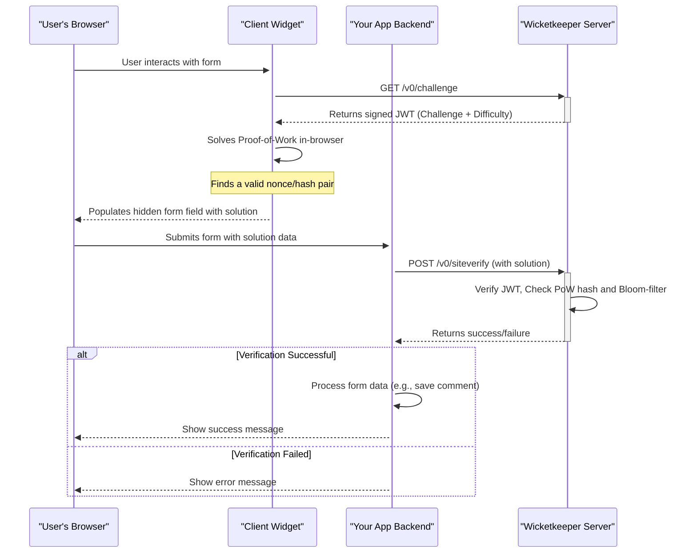

<p align="center">
  <a href="https://wicketkeeper.io"></a>
</p>


A privacy-friendly, proof-of-work (PoW) captcha system designed to be a user-centric alternative to traditional captchas. Wicketkeeper protects your web forms from simple bots without requiring users to solve frustrating puzzles.

It achieves this by issuing a small, client-side computational challenge that is easy for a modern device to solve but costly for bots to perform at scale. The system is comprised of a Go backend, an embeddable JavaScript client, and a full-stack demo application.

---

## Table of Contents

- [Features](#features)
- [How It Works](#how-it-works)
- [Project Structure](#project-structure)
- [Getting Started: Full Demo Setup](#getting-started-full-demo-setup)
  - [Prerequisites](#prerequisites)
  - [Step 1: Clone the Repository](#step-1-clone-the-repository)
  - [Step 2: Run the Backend Services](#step-2-run-the-backend-services)
  - [Step 3: Build the Client Widget](#step-3-build-the-client-widget)
  - [Step 4: Run the Example Application](#step-4-run-the-example-application)
- [Usage of Individual Components](#usage-of-individual-components)
  - [Wicketkeeper Server (Go)](#wicketkeeper-server-go)
  - [Client Widget (JavaScript)](#client-widget-javascript)

## Features

- **Proof-of-Work Engine:** Replaces visual puzzles with a computational challenge that is easy for users but hard for bots.
- **Stateless & Secure:** Uses signed JSON Web Tokens (JWTs) for challenge/response cycles, eliminating server-side session state.
- **Replay Attack Prevention:** Leverages Redis Bloom filters for high-performance, time-windowed prevention of challenge reuse.
- **Embeddable Client Widget:** A lightweight, dependency-free JavaScript widget that integrates easily into any web form.
- **Configurable:** Easily adjust PoW difficulty, CORS origins, and ports via environment variables.
- **Containerized:** Full Docker and Docker Compose support for easy deployment of the backend server and its Redis dependency.
- **Full-Stack Demo:** Includes a complete Express.js + TypeScript example to demonstrate a real-world integration.

## How It Works

The Wicketkeeper ecosystem involves four main actors: the User's Browser, the Client Widget, your Application Backend, and the Wicketkeeper Server.



1.  **Challenge Request:** The client widget requests a new PoW challenge from the Wicketkeeper Server.
2.  **Challenge Issuance:** The server generates a unique challenge, packages it into a signed JWT, and sends it to the client.
3.  **Proof of Work:** The client's browser (using Web Workers) finds a solution (`nonce`) to the cryptographic puzzle.
4.  **Form Integration:** The solution is placed into a hidden input field in your web form.
5.  **Server-Side Verification:** When the user submits the form, your application's backend sends the solution to the Wicketkeeper Server's `/v0/siteverify` endpoint.
6.  **Validation:** The Wicketkeeper Server validates the JWT signature, the PoW correctness, and checks a Redis Bloom filter to ensure the challenge hasn't been used before. It returns a final success or failure response.

## Project Structure

The repository is organized into three main components:

```
.
├── client/          # The frontend JS widget that solves the PoW challenge
├── server/          # The Go backend that issues and verifies challenges
├── example/         # A full-stack Express.js demo application
└── README.md        # This file
```

## Getting Started: Full Demo Setup

This guide will help you run the full Wicketkeeper ecosystem, including the backend server, the client widget, and the example application.

### Prerequisites

- [Go](https://go.dev/doc/install) (v1.23+)
- [Node.js](https://nodejs.org/) (v16+) and npm
- [Docker](https://www.docker.com/products/docker-desktop/) and Docker Compose

### Step 1: Clone the Repository

```bash
git clone https://github.com/a-ve/wicketkeeper.git
cd wicketkeeper
```

### Step 2: Run the Backend Services

The easiest way to run the Go server and its Redis dependency is with Docker Compose.

```bash
cd server/
mkdir data
docker-compose up -d
```

This will build and start the `wicketkeeper` Go service on port `8080` and a `redis-stack` container. On the first run, a `wicketkeeper.key` file will be generated in `server/data/`.

### Step 3: Build the Client Widget

The client widget needs to be compiled into a single JavaScript file.

```bash
cd ../client/
npm install
npm run build:fast
```

This creates `client/dist/fast.js`. Now, copy this file to the example application's public directory:

```bash
cp dist/fast.js ../example/public/
```

### Step 4: Run the Example Application

The example is an Express.js server that serves a simple HTML form and handles submissions.

```bash
cd ../example/
npm install

# Compile the TypeScript code
npx tsc

# Start the server
node dist/server.js
```

You should see the output: `🚀 Server listening on http://localhost:8081`.

You can now navigate to **<http://localhost:8081>** in your browser to see the Wicketkeeper demo in action!

## Usage of Individual Components

### Wicketkeeper Server (Go)

The server is configured via environment variables. See `server/README.md` for more details.

| Variable           | Description                                                                 | Default              |
| ------------------ | --------------------------------------------------------------------------- | -------------------- |
| `LISTEN_PORT`      | The port on which the server will listen.                                   | `8080`               |
| `REDIS_ADDR`       | The address of the Redis instance.                                          | `127.0.0.1:6379`     |
| `DIFFICULTY`       | Number of leading zeros for the PoW hash. Higher is harder.                 | `4`                  |
| `ALLOWED_ORIGINS`  | Comma-separated list of origins for CORS (e.g., `https://domain.com`).      | `*`                  |
| `PRIVATE_KEY_PATH` | Path to store the Ed25519 private key. Will be created if it doesn't exist. | `./wicketkeeper.key` |

**API Endpoints:**

- `GET /v0/challenge`: Issues a new PoW challenge.
- `POST /v0/siteverify`: Verifies a solved challenge.

### Client Widget (JavaScript)

The client is a single JS file (`dist/fast.js` or `dist/slow.js`) that can be included in any HTML page.

**1. Include the Script**

```html
<script defer src="path/to/fast-or-slow.js"></script>
```

**2. Add the Widget to a Form**

The script automatically initializes any `div` with the class `.wicketkeeper`.

```html
<form action="/submit" method="POST">
  <!-- Other form fields -->
  <div class="wicketkeeper" data-input-name="my_captcha_field"></div>
  <button type="submit">Submit</button>
</form>
```

The client can be configured with a custom challenge endpoint during the build step. See `client/README.md` for details.
